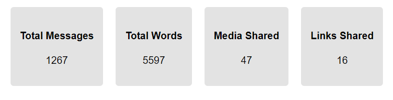
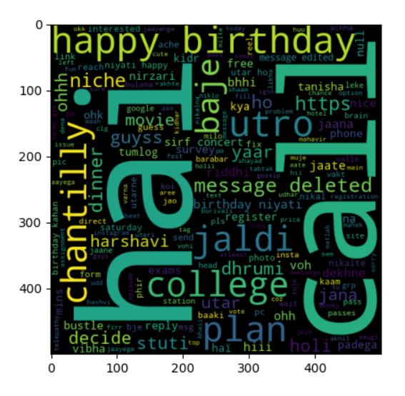
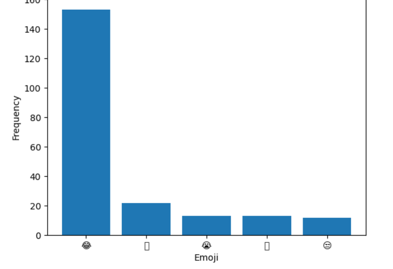

# Whatsapp Chat & Sentiment Analysis

A Flask-based web application to analyze WhatsApp chat exports and visualize insights like message statistics, word clouds, emoji usage, timelines, and sentiment trends.


## Features

**WhatsApp Chat Analysis:**
- Upload `.txt` chat exports directly.
- View message statistics:
  - Total messages
  - Total words
  - Media shared
  - Links shared
- Identify most active users.
- Generate Word Cloud of frequently used words.
- See Most Common Words in the chat.
- Emoji usage breakdown with bar chart.
- Monthly timeline of messages.

**Sentiment Analysis:**

- Analyze chat sentiment using VADER Sentiment Analysis (NLTK).
- Sentiment classification: Positive, Negative, Neutral.
Visualize:
- Sentiment trends over time.
- User-level sentiment distribution.
- Positive & Negative Word Clouds.


## Tech Stack

- **Frontend:** Jinja2 templates, HTML, CSS, JavaScript (jQuery, Fetch API)
- **Backend:** Python, Flask
- **Libraries:**, pandas, matplotlib, wordcloud, urlextract, emoji, nltk (VADER Sentiment)
- **Visualization:** Matplotlib (converted to Base64 images for display)
## Workflow

- Upload WhatsApp exported chat file (.txt).
- Select a user or analyze Overall chat.
- Explore statistics, charts, and sentiment dashboards.
## Run Locally

1. Clone the project

```bash
git clone https://github.com/yourusername/whatsapp-chat-analyzer.git
```

2. Go to the project directory

```bash
cd whatsapp-chat-analyzer
```

3. Create Virtual Environment & Install Dependencies

```bash
python -m venv venv
source venv/bin/activate   # On Windows: venv\Scripts\activate
pip install -r requirements.txt
```

4. Start the Flask App

```bash
python app.py
```

5. Open in Browser
```cpp
http://127.0.0.1:5000/
```

## Installation

Install NLTK Data (for Sentiment)

```bash
python
>>> import nltk
>>> nltk.download('vader_lexicon')
```
## Screenshots

Dashboard


Whatsapp Chat Analysis


Whatsapp Chat Sentiment Analysis


## Example Visuals

#### Analysis Result


#### Word Cloud


#### Emoji Usage


#### Sentiment Trend


#### Sentiment Trend


#### Positive Wordcloud


#### Negative Wordcloud
